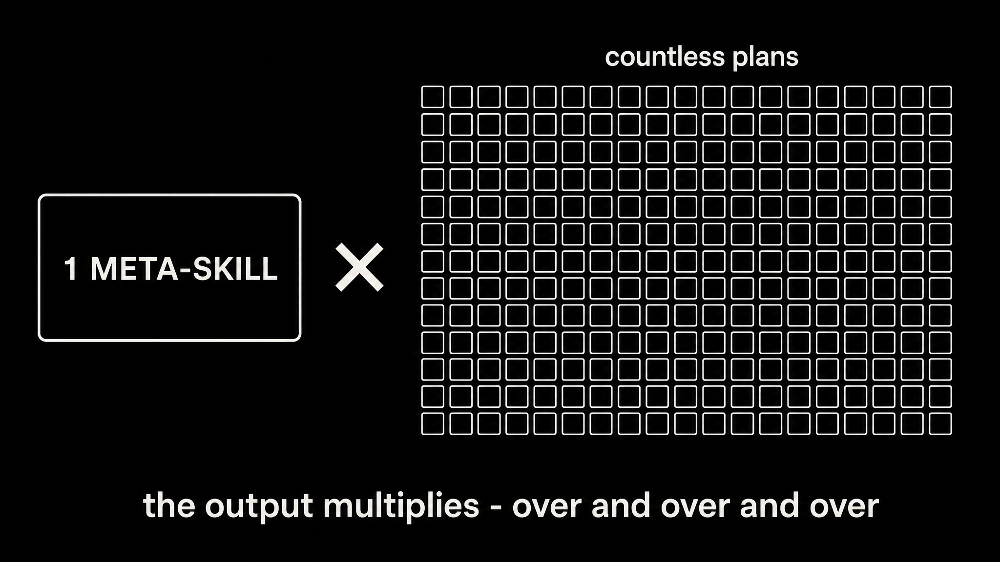
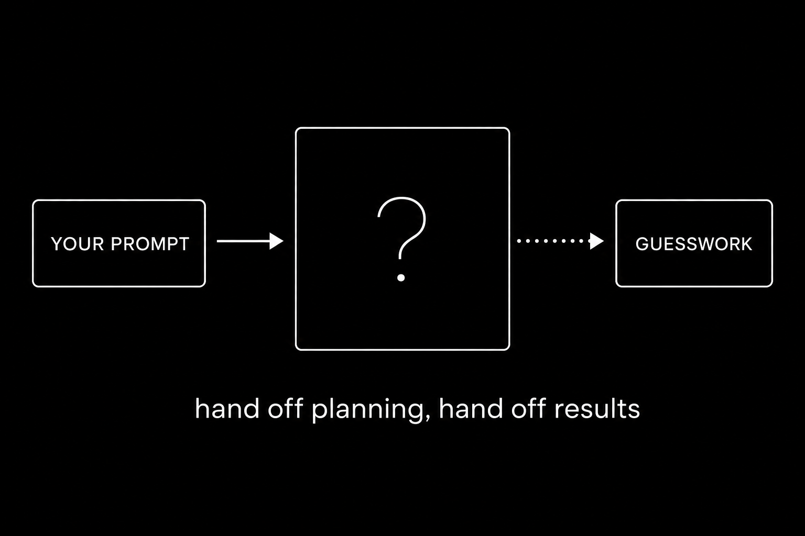
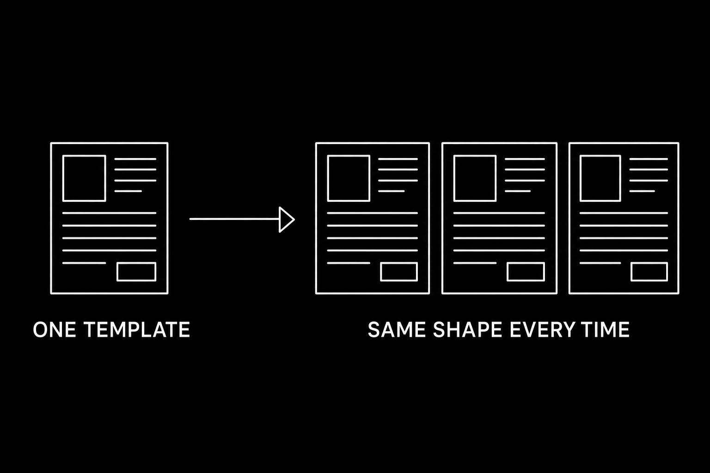
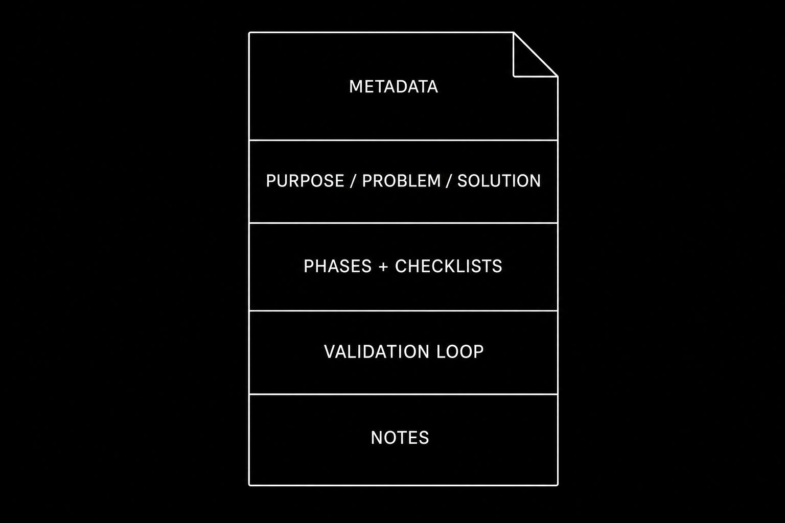
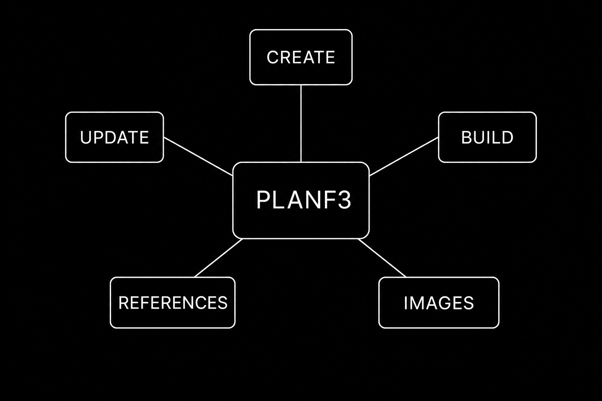
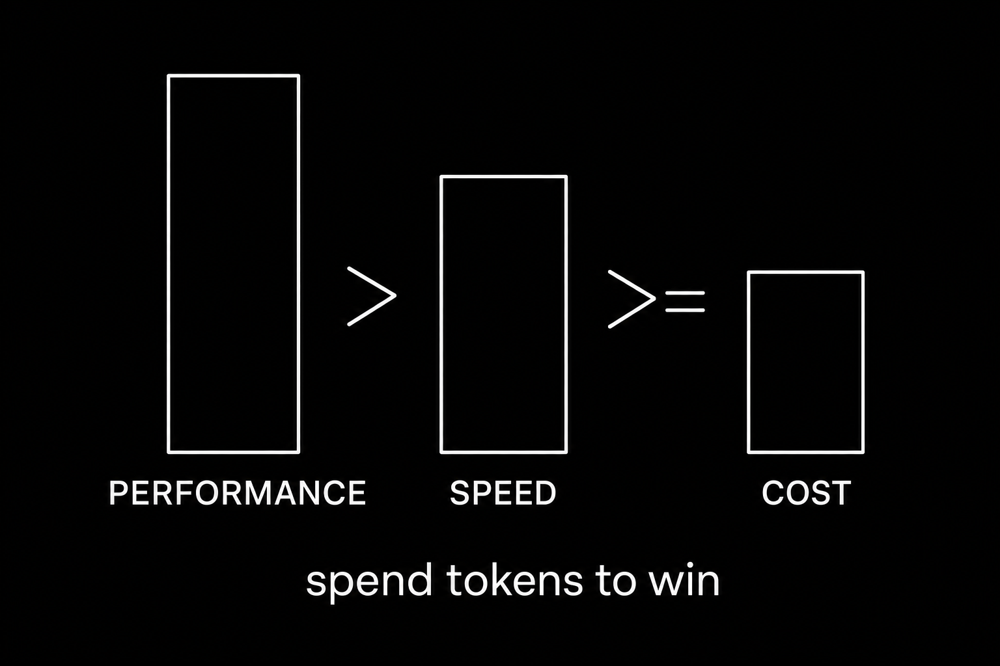
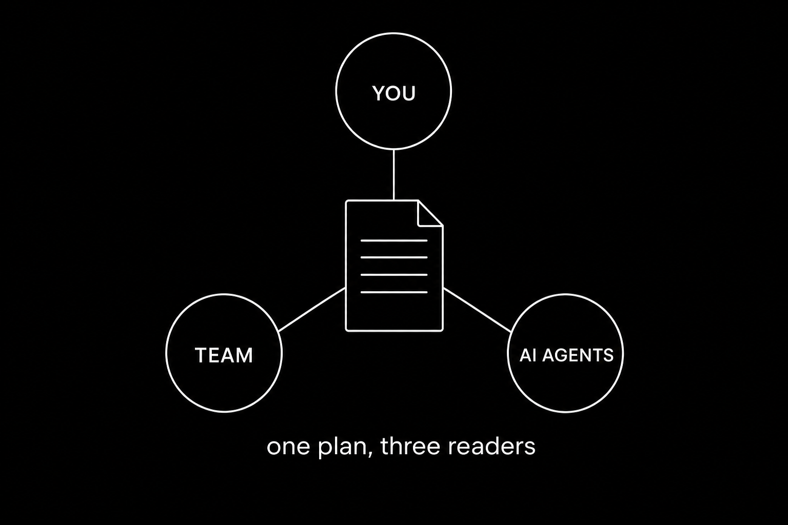
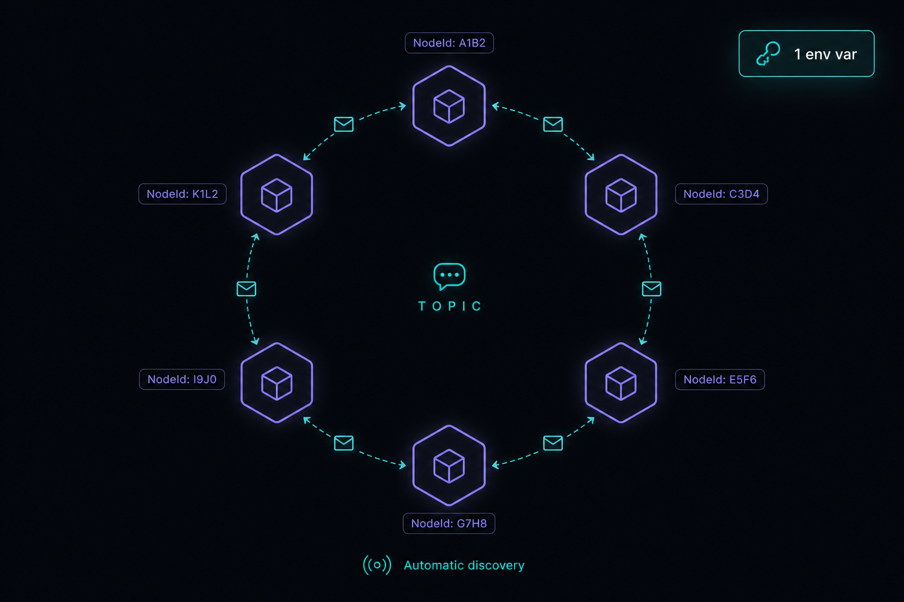

# Planf3 — Plans For Fable Five

> **A [Mythos-class](https://www.anthropic.com/news/claude-fable-5-mythos-5) planning meta-skill: one skill that writes, builds, and maintains every plan your agents run.**
> Built for the agent trifecta: you, your team, and your AI agents.

📺 Watch this video to get the full breakdown of this codebase: **[Planf3 on YouTube](https://youtu.be/DzbqeO_diOQ)**

<p align="center">
  
</p>

Most engineers hand planning to the model and hope. `/plan` goes into a black box, something comes out, and you review whatever you get. Planf3 inverts that: you template your engineering once (the exact sections, the exact loops, the exact visual identity), and every plan the agent writes mirrors it, forever.

The big unlock is the new Mythos-class models (Fable 5 and what follows). They raise the intelligence ceiling far enough to absorb a token-rich, HTML-first plan and hit the *exact* outcomes you specify, which is the next level of planning ability we've been waiting for. Planf3 was built to pull that capability out of them: it deliberately spends tokens, images, and structure to extract the best plan these models can produce. Every property in the skill exists to capture that ceiling, and the payoff compounds with each more-capable model. **Great planning is great engineering, and this is the skill that encodes yours.**

---

## Install

Planf3 is a Claude Code Agent Skill (it runs in Pi, Codex, opencode, or any harness that reads `.claude/skills/`). There's nothing to compile; "installing" is putting the skill where your agent can find it and wiring one API key for image generation.

### Agentic Install

Open this repo in your agentic coding tool and prompt:

```
Read .claude/skills/planf3/SKILL.md and install this skill for me:
copy it to ~/.claude/skills/planf3 so /planf3 works in every project,
then copy .env.sample to .env and tell me which key to set.
```

The skill is self-contained. `SKILL.md`, the five `workflows/`, and the two image `scripts/` move together with no cross-dependencies.

### Manual Install

**Prereqs:** [`claude`](https://docs.claude.com/en/docs/claude-code) (or [`pi`](https://pi.dev/) / Codex / opencode), [`uv`](https://docs.astral.sh/uv/) (runs the image scripts), and an [`OPENAI_API_KEY`](https://platform.openai.com/api-keys) for `gpt-image-2`.

```bash
# 1. Use it project-local (already here), or install globally:
cp -r .claude/skills/planf3 ~/.claude/skills/planf3   # /planf3 everywhere

# 2. Wire the image-generation key
cp .env.sample .env                                    # then add OPENAI_API_KEY=sk-...

# 3. Run it
#    /planf3 "<what you want planned>" [questionable]
```

`questionable` defaults to `false`. Set it to `true` to make the agent surface open decisions in a toggleable Q&A section instead of silently deciding.

---

## Why this exists

<p align="center">
  
</p>

There are two hard constraints in agentic engineering: **planning** and **reviewing**. Most engineers spend their effort on the second one: babysitting output, catching drift, re-prompting. That's backwards. A vague `/plan` forces the model to guess what you want; you pay for the guess on every review pass that follows. The upfront plan is the cheapest place to buy correctness.

<p align="center">
  
</p>

Planf3 is a **meta-skill**, a skill that produces other artifacts. You write the plan *format* once, and the agent reproduces it across hundreds of executions: same sections, same checklists, same validation loops, same look. That consistency is you teaching the agent *how you engineer*. **More upfront investment in the plan means less reviewing later, and the gap widens with every more-capable model.**

---

## How it works

Planf3 takes a prompt and emits a single self-contained `.html` plan into `specs/`. HTML-first is a deliberate trade: it costs more tokens than markdown, and it buys a plan that opens in a browser, embeds synced diagrams, and reads cleanly for all three audiences. Of the trade-off trifecta (performance, speed, cost) this skill spends speed and cost to maximize performance.

The skill's API is one line:

```
/planf3 "<user prompt>" [questionable]
```

| Input | Meaning |
|---|---|
| `USER_PROMPT` | What to plan, build, update, or illustrate — this also selects the workflow |
| `QUESTIONABLE` | `true` surfaces assumptions in a toggleable Q&A section; defaults to `false` |

On a create run the agent reads the prompt, explores the codebase (plus `AI_DOCS/` and `APP_DOCS/` if present), authors the HTML plan from the template, generates one diagram per section in parallel, and opens the result in your browser.

---

## The plan template

<p align="center">
  
</p>

The heart of the skill is the **Plan Template** in [`SKILL.md`](.claude/skills/planf3/SKILL.md): the structure the agent mirrors every time. `{{PLACEHOLDER}}` tokens get replaced with real content; `<!-- repeat -->` blocks duplicate per phase, task, or file. Every plan carries:

| Section | What it gives the trifecta |
|---|---|
| **Updatable metadata** | `created`, plus append-only lists of `modified`, `commits`, `agent`, `session`, and back/forward references — the plan is a living artifact |
| **Purpose / Problem / Solution** | The why, the pain, the approach — each with a focused diagram |
| **Relevant Files** | Existing files (tagged) vs new files, so the builder knows the blast radius |
| **Implementation Phases** | Phased work, each phase carrying per-task checklists and a Testing Strategy |
| **Validation loop** | A closed loop — *do not exit until every box is checked and every command passes* |
| **Notes** | Open canvas where the planning agent runs free — matrices, tradeoffs, rejected approaches |
| **Amendments** | Append-only history of changes made *after* the plan was first built |

Status markers (`[]` idle · `[wip]` in progress · `[x]` complete · `[f]` failed) live right in the checklist, so the build agent tracks its own progress inside the plan itself.

---

## The five workflows

<p align="center">
  
</p>

Planf3 is one skill, but the prompt routes to one of five dedicated workflows. This keeps the plan a living artifact across the whole lifecycle of the codebase, not a write-once document.

| Workflow | Trigger | File |
|---|---|---|
| **Create Plan** | Plan/spec/design new work, no existing plan referenced | [`create-plan.md`](.claude/skills/planf3/workflows/create-plan.md) |
| **Update Plan** | Change, extend, or revise an existing plan (surgical edit + amendment) | [`update-plan.md`](.claude/skills/planf3/workflows/update-plan.md) |
| **Update References** | Refresh metadata or wire bidirectional back/forward references | [`update-references.md`](.claude/skills/planf3/workflows/update-references.md) |
| **Build Plan** | Implement the work in an existing plan, updating status markers as it goes | [`build-plan.md`](.claude/skills/planf3/workflows/build-plan.md) |
| **Image Generation** | Subworkflow — fills or regenerates the embedded `gpt-image-2` diagrams | [`image-generation.md`](.claude/skills/planf3/workflows/image-generation.md) |

The **Build Plan** workflow is the payoff: a fresh agent reads the full plan (every image, every back reference at depth 1), then executes phases top to bottom, looping on each phase's tests until they pass, marking `[x]` or `[f]` as it goes.

---

## Priorities

<p align="center">
  
</p>

> *`Performance > Speed >= Cost`*

This is the design axis of the whole skill, and it's why planf3 looks "expensive." HTML over markdown, embedded images, rich updatable metadata, generated diagrams: none of that is the cheap choice. It's the choice that gives the best plan. When you run state-of-the-art models, **make the sacrifices you need to get state-of-the-art results.** Cost, here, is just tokens.

---

## Who it's for

<p align="center">
  
</p>

Every choice in planf3 serves the **agent trifecta**: the engineer (you), the engineering team, and the AI agents. Most planning systems over-index on one: pure agent JSON nobody can read, or a human doc no agent can act on. The HTML-first format, the embedded diagrams, the checklists, and the metadata header exist so a single plan satisfies all three at once.

---

## Folder structure

```
planf3/
├── README.md                       # this file
├── RAW.md                          # the raw think-out-loud spec that started the build
├── legacy_v1_meta_plan.md          # the V1 markdown spec planf3 evolved from
├── .env.sample                     # OPENAI_API_KEY= (image generation)
│
├── .claude/skills/planf3/          # the meta-skill itself (self-contained)
│   ├── SKILL.md                    # API, instructions, and the HTML Plan Template
│   ├── workflows/                  # one file per workflow
│   │   ├── create-plan.md
│   │   ├── update-plan.md
│   │   ├── update-references.md
│   │   ├── build-plan.md
│   │   └── image-generation.md     # subworkflow — gpt-image-2 diagrams
│   └── scripts/
│       ├── generate_gpt_image.py   # uv single-file script — create image
│       └── edit_gpt_image.py       # uv single-file script — edit image
│
├── prompts/
│   └── pi-iroh-coms.md             # the demo prompt
│
├── specs/                          # where plans land
│   ├── pi-iroh-coms-net.html       # a REAL planf3 plan — open it in a browser
│   └── pi-iroh-coms-net/           # its synced, generated section images
│
└── images/                         # README diagrams
```

---

## See it in action

<p align="center">
  
</p>

[`specs/pi-iroh-coms-net.html`](specs/pi-iroh-coms-net.html) is a real, unedited planf3 output. The prompt in [`prompts/pi-iroh-coms.md`](prompts/pi-iroh-coms.md) asked the agent to re-implement an HTTP agent-communication extension as a serverless peer-to-peer mesh on [iroh](https://iroh.computer). One `/planf3` run produced:

- a full HTML plan with metadata, four phases, per-phase checklists, and validation loops
- eight synced diagrams (hero, problem, solution, one per phase, notes) generated in parallel
- a freeform Notes section where the agent authored its own feature-parity matrix

Open the `.html` in a browser to see exactly what the skill delivers.

```bash
open specs/pi-iroh-coms-net.html        # macOS
```

---

## Where it can still fail

Honest edges to know before you ship plans with this:

- **It's tuned for top-tier models.** Planf3 deliberately spends tokens and time. On smaller models the HTML, metadata, and image steps can overwhelm the budget; it runs, but the payoff curve is steepest on Mythos-class models.
- **`OPENAI_API_KEY` gates the images.** No key, no diagrams. The plan still writes; the `{{...IMAGE}}` slots just stay empty until you run the Image Generation workflow.
- **The agent will sometimes over-reach.** These models take one instruction and run with the whole context, so expect occasional extra edits beyond what you asked. Be surgical in your prompts; review the diff.
- **Stray context bleeds in.** If other specs sit in `specs/`, a create run may reference them. Keep the output directory clean, or point back references deliberately.
- **`AI_DOCS/` and `APP_DOCS/` are optional.** The skill reads them if they exist; it won't create them. Add them when you want the plan grounded in your own documentation.

---

## License

MIT — see [`LICENSE`](LICENSE).

---

## Master Agentic Coding

Prepare for the future of software engineering.

Learn tactical agentic coding patterns with [Tactical Agentic Coding](https://agenticengineer.com/tactical-agentic-coding?y=planf3).

Follow the [IndyDevDan YouTube channel](https://www.youtube.com/@indydevdan) to improve your agentic coding advantage.

---

Stay Focused and Keep Building

- IndyDevDan
